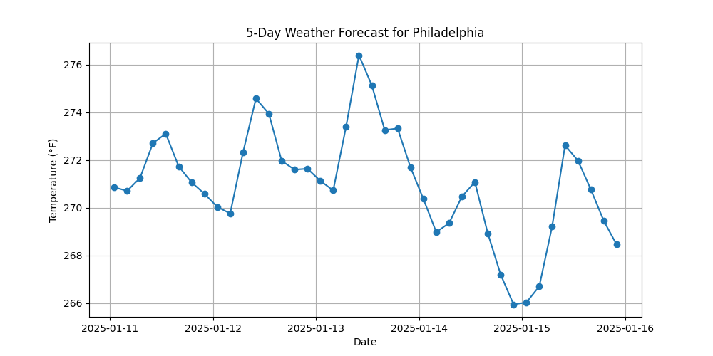

# Weather Dashboard

## Overview
The Weather Dashboard is a Python application that fetches and displays weather data for multiple cities. It uses the OpenWeather API to retrieve current weather information and can save the data to an AWS S3 bucket.

## Features
- Fetches current weather data for specified cities.
- Displays temperature, feels-like temperature, humidity, and weather conditions.
- Saves weather data to an AWS S3 bucket.
- Plots a 5-day temperature forecast for each city using Matplotlib.

## Prerequisites
- **Python 3.x** installed on your machine.
- **An OpenWeather API key**. Sign up at [OpenWeather](https://home.openweathermap.org/users/sign_up).
- **AWS CLI** installed and configured with an IAM user. Download it [here](https://aws.amazon.com/cli/).

## Project Structure
```
Weather_API_Dashboard/
├── src/
│   └── weather_dashboard.py
├── .env
├── requirements.txt
├── images/
└── README.md
```
- `src/weather_dashboard.py`: Main script for fetching weather data, plotting temperature forecasts, and saving data to AWS S3.
- `requirements.txt`: Lists Python packages required to run the project.
- `.env`: Contains environment variables like the OpenWeather API key and AWS bucket name.
- `images/`: Stores images for the README or other documentation.

## Setup
1. Clone the repository:
   ```bash
   git clone https://github.com/Stormz99/Weather_API_Dashboard
   cd Weather_API_Dashboard
   ```

2. Create a virtual environment and activate it:
   ```bash
   python3 -m venv .venv
   source .venv/bin/activate  # macOS/Linux
   .venv\Scripts\activate     # Windows
   ```

3. Install required packages:
   ```bash
   pip install -r requirements.txt
   pip install matplotlib
   ```

4. Create a `.env` file in the root directory and add the following:
   ```env
   OPENWEATHER_API_KEY=your_openweather_api_key
   AWS_BUCKET_NAME=your_aws_bucket_name
   ```

5. Manually create an S3 bucket in your AWS account. Ensure the name matches `AWS_BUCKET_NAME` in the `.env` file.

## Usage
Run the `weather_dashboard.py` script to fetch weather data and plot forecasts:
```bash
python src/weather_dashboard.py
```

The script will:
- Fetch current weather data for specified cities.
- Save weather data to the AWS S3 bucket.
- Display 5-day temperature forecast plots.

### Sample Output
```
City: New York
Temperature: 68°F
Feels Like: 70°F
Humidity: 50%
Weather: Clear skies
```

## Example Screenshots
**AWS S3 Dashboard:**


**5-Day Forecast Plots:**
- **Philadelphia:**
  
- **New York:**
  
- **Seattle:**
  
- **Berlin:**
  
- **Auckland:**
  

## Notes
- Ensure API keys and bucket names in the `.env` file are correct.
- S3 bucket names must be globally unique.
- Matplotlib must be installed for plotting functionality.
